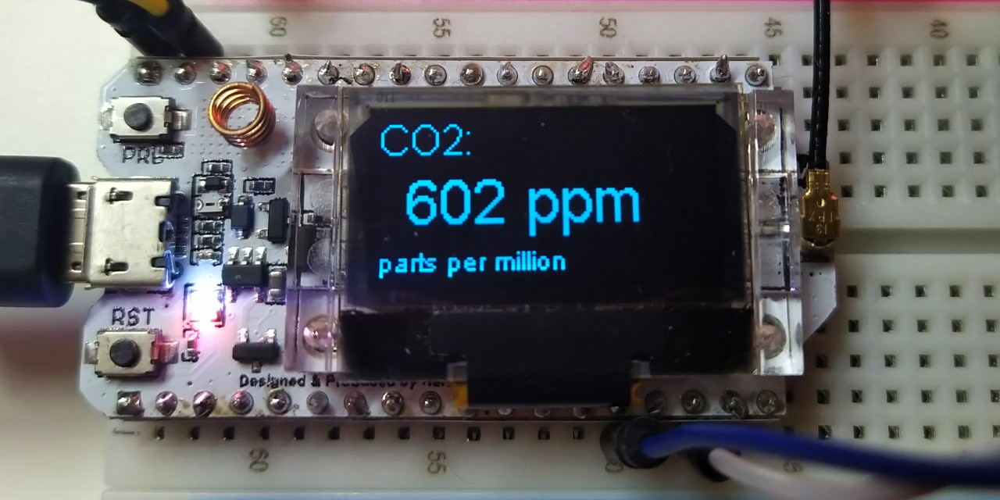
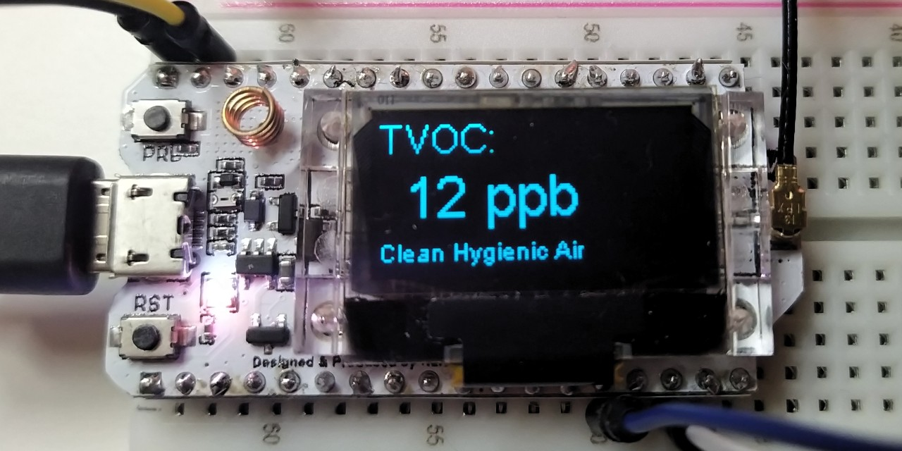
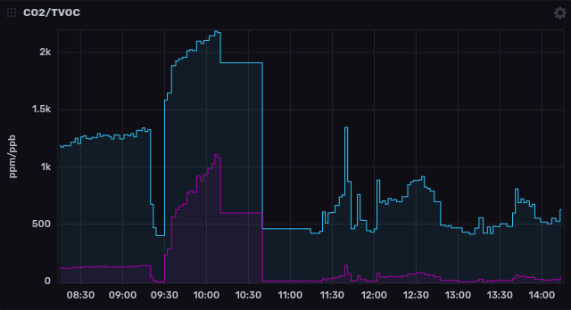

# CO2-TVOC-Sensor
A sensor to report carbon dioxide and volatile organic compound levels to MQTT and an ESP32's display



## Functions
Currently the firmware has the following functions:

* Browser based WiFi configuration.
* Reporting of CO2, TVOC, temperature, humidity, pressure, PM1, PM2.5, and PM10 values to Display
* Reporting of values to MQTT
* Setting CCS811 baseline (automatically and manually) and restoring it at boot



## Hardware Requirements

### ESP32 with OLED Display. 
The code has been written for and tested on a [Heltec WiFi LoRa 32 (V2)](https://heltec.org/project/wifi-lora-32/) but should also work on the cheaper [WiFi Kit 32](https://heltec.org/project/wifi-kit-32/). Since the code makes use of Heltec's Arduino library to access the Display, hardware Support is currently limited to their devices.

### CCS811 Sensor
To measure carbon dioxide and volatile organic compound levels a [CCS811](https://www.sciosense.com/products/environmental-sensors/ccs811-gas-sensor-solution/) Sensor is being connected through I2C. 

### BME/BMP280 Sensor
To set the environment variables of the CCS811 we need a data source for temperature and humidity. The BME/BMP280 sensor provides this data. 

```
g_bme_humidity = bme.readHumidity();
g_bme_temperature = bme.readTemperature();
ccs.setEnvironmentalData(g_bme_humidity, g_bme_temperature);
```

## Optional Hardware

### PMS5003 Particle Sensor
A PMS5003 particle sensor can be connected to read fine dust values PM1, PM2.5, and PM10.


## Connections
The connections are:

### Heltec WiFi LoRa V2:
```
ESP32   -   CCS811  -   BME/BMP280
==================================
GND     -   GND     -   GND
3.3V    -   VCC     -   VIN
4       -   SDA     -   SDA
15      -   SCL     -   SCL
3       -   WAKE

ESP32   -   PMS5003
===================
22 (RX) -   5 (TX)
23 (TX) -   4 (RX)
GND     -   2 (GND)
5V      -   1 (VCC)
```

### Heltec WiFi Kit 8 (currently not compiling!)
Attention: Check the [WiFi Kit 8 Pinout Diagram](https://resource.heltec.cn/download/WiFi_Kit_8/WIFI_Kit_8_Pinout_Diagram.pdf) to find the correct PINs. What's written on the NodeMCU is most likely wrong!

```
ESP8266 -   CCS811  -   BME/BMP280
==================================
GND     -   GND     -   GND
3.3V    -   VCC     -   VIN
GPIO4   -   SDA     -   SDA
GPIO5   -   SCL     -   SCL
GPIO14  -   WAKE
```


## Software Requirements

### Compilation and Development

* Visual Studio Code
* PlatformIO
* The libraries listed in main.cpp installed

### Reporting


Must have:

* MQTT Broker (e.g. Mosquitto)

Optional for storage and visualization of long term data:

* Node-RED
* Influx-DB
* Grafana

## What is there to improve? / Open Tasks

* Designing the firmware's integrated webpage
* Showing WiFi- and MGTT-State on OLED
* Supporting more OLED screens and other ESP32 and ESP8266 devices
* Code documentation
* LoRa/LoRaWan support
* Internationalization / translation

Your help is appreciated! Like to become a contributor?